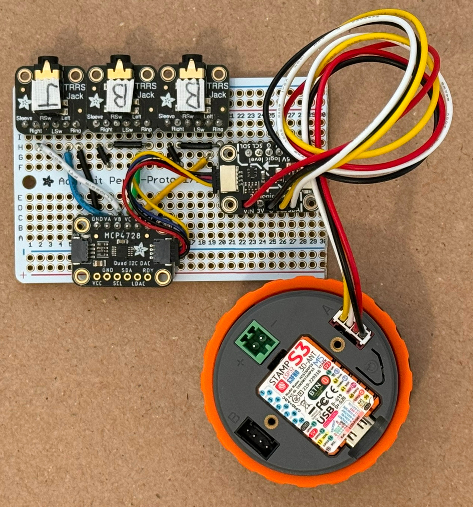

# M5Stack Dial Capacitive Touch Analog Joystick

The M5Dial analog joystick can be used with the Sony Access Controller (SAC) as
well as the Xbox Adaptive Controller (XAC) X1, X2 inputs.

Tested using Arduino IDE 1.8.19 and [M5Stack Dial](https://docs.m5stack.com/en/core/M5Dial).

The XAC has USB host ports for USB joysticks but the SAC does not. The SAC has
expansion ports for analog joysticks. This project coverts touchscreen touches
to analog joystick voltages using a four channel digital to analog converter
(DAC).

The level shifter board is used because the M5Stack grove port outputs 5V VCC
but expects 3.3V logic levels on SDA and SCL.

## Hardware

* 1 X Sony Access Controller (SAC) for PS5
* 1 X M5Stack Dial
* 3 X Adafruit TRRS Jack Breakout Board
* 3 X TRRS cables
* 1 X Adafruit MCP4728 Quad DAC Breakout Board
* 1 X Adafruit QT 5V to 3V Level Shifter Breakout - STEMMA QT / Qwiic
* 1 X Adafruit Perma-Proto Half-sized Breadboard
* 1 X [Seeed Studio Grove - 4 pin Female Jumper to Grove 4 pin Conversion Cable)](https://www.digikey.com/en/products/detail/seeed-technology-co-ltd/110990028/5482559)
* 1 X 5V phone charger with USB Type C connector to power the M5Dial

Note: For the grove cable, cut off the lock/latch/buckle using wire cutters.

## Dependencies

Install the following libraries using the Arduino IDE Library Manager.

* "M5CoreS3" by M5Stack
* "M5Dial" by M5Stack
* "M5Unified" by M5Stack
* "M5GFX" by M5Stack
* "Adafruit BusIO" by Adafruit

The following can be downloaded as a ZIP file then installed using the IDE "Add
.ZIP Library" option.

* https://github.com/touchgadget/Adafruit_MCP4728_eeprom

## Arduino IDE Build options for M5Stack Dial

Espressif released arduino-esp32 v 3.0.0. V3 has the M5Dial Board type so use
it. If using an older version such as 2.0.17, select Stamp-S3.

To get the M5Dial into bootload mode, press and hold the BTN0 button at the
middle of the M5Dial then press and release the RESET button on the right side.
Then release BTN0. On other ESP32 boards the BTN0 button is usually labeled the
BOOT button.  The colorful label covers BTN0 but the button can be pressed
without removing the label.

## References

[Access™ Controller for PlayStation®5 Expansion Port Specifications Version 1.00](https://www.playstation.com/content/dam/global_pdc/en/corporate/support/manuals/accessories/ps5-accessories/access-controller/access-docs/Access%20Controller%20for%20PlayStation%205%20Expansion%20Port%20Specifications.pdf)
